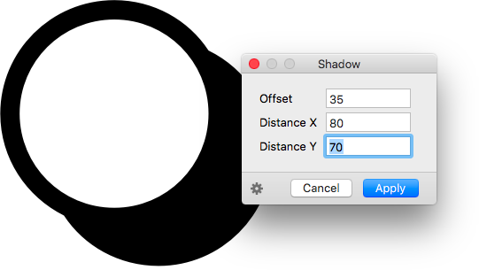
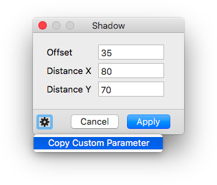

# Shadow.glyphsFilter

This is a plugin for the [Glyphs font editor](http://glyphsapp.com/) by Georg Seifert.
It turns your glyphs into shadowed versions of themselves. After installation, it will add the menu item *Filter > Shadow*. You can set a keyboard shortcut in System Preferences.

### Installation

1. Download the complete ZIP file and unpack it, or clone the repository.
2. Double click the .glyphsFilter file. Confirm the dialog that appears in Glyphs.
3. Restart Glyphs.

### Usage Instructions

1. Select a glyph in Edit View, or select any number of glyphs in Font or Edit View.
2. Choose *Filter > Shadow*.

Alternatively, you can also use it as a custom parameter:

	Property: Filter
	Value: Shadow; offset:<number>; distanceX:<number>; distanceY:<number>

... where the `<number>` value for `offset` is the thickness of the shadow, the `<number>` values for `distanceX` and `distanceY` are the horozontal and vertical distance of the shadow from the original path, e.g.:
	
	Property: Filter
	Value: Shadow; offset:35.0; distanceX:135.0; distanceY:135.0

At the end of the parameter value, you can hang `exclude:` or `include:`, followed by a comma-separated list of glyph names. This will apply the filter only to the included glyphs, or the glyphs not excluded, respectively.

### Copy and Paste the Custom Parameter

Via the gear menu in the lower left corner of the window, you can copy a custom parameter for the current settings into your clipboard:

Afterwards, you can go to *File > Font Info > Instances* (Cmd-I), select an instance in the sidebar of the window, click in the *Custom Parameters* field in order to set the focus, and simply paste it (Cmd-V).

### Requirements

The plugin needs Glyphs 2.3 or higher, running on OS X 10.9.1 or later.

### License

Copyright 2016 Rainer Erich Scheichelbauer (@mekkablue).
Based on sample code by Georg Seifert (@schriftgestalt) and Jan Gerner (@yanone).

Licensed under the Apache License, Version 2.0 (the "License");
you may not use this file except in compliance with the License.
You may obtain a copy of the License at

http://www.apache.org/licenses/LICENSE-2.0

See the License file included in this repository for further details.
